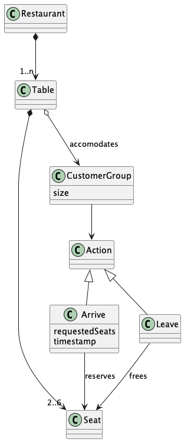
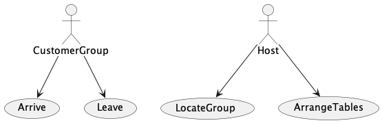

# Customer Allocation System on a Restaurant

## Intention and context

The system optimizes the allocation of customers in a restaurant by grouping them in the same table.
This solution and process should be scoped in the context of a technical challenge for a job interview.

Some of the information in this document is included in order to give context to the reader. Not everything is intended to be part of a real scenario documentation. Verbosity is sometimes excessive. Sorry for that.

## [Original problem statement](./Instructions.md)

## Stack and usage

The system is implemented in Node.js using plain JavaScript. The code is in the [src](src) folder and the tests are in the [test](test) folder.

No production dependencies are used.
Dev dependencies used:

- [Mocha](https://mochajs.org/): Test runner.
- [Chai](https://www.chaijs.com/): Assertion library.
- [Eslint](https://eslint.org/): Linter.

To run the tests:

```bash
npm test | yarn test

OR

npm test:unit | yarn test:unit
npm test:acceptance | yarn test:acceptance
npm test:performance | yarn test:performance
npm test:performance:metrics | yarn test:performance:metrics
```

## Development process

> NOTE: A raw, informal, version of the development process can be found in the [devlog.md](devlog.md) file. This file contains thoughts and ideas that I had during the development process in chronological order. It is not intended to be documentation but to give an idea of the thought process

In order to develop the system I feel the need to understand the problem and the domain. I did this by following the following steps in an iterative way:

- Define the [domain model](#domain-model)
- Define the [use cases](#use-cases)

Those two diagrams have been alive during the development process and have been updated as the understanding of the problem and the domain evolved.

### Domain model

The domain model is a representation of the domain in which the system will be used. It is a simplified model of the domain that is used to understand the problem and to communicate with the stakeholders. The domain model is not a model of the system itself.

The domain model is defined in the [domain model](docs/output/docs/src/DomainModel/DomainModel.png) file.



### Use cases

The use cases are a representation of the functionality of the system. They are used to understand the problem, guide the development and to communicate with the stakeholders.

An interesting outcome of analyzing the use cases was to conclude that, in the context of this problem, the table arrangement is done at construction time according to the instructions.

The use cases are defined in the [use cases](docs/output/docs/src/DomainModel/DomainModel.png) file.



## Pragmatic development approach

After working a while in the problem, I started the development of the code using TDD.
By focusing on the tests I indtended to keep the development process close to the requirements (and the user) and as simple as possible avoiding overengineering.

The first tests written where some acceptance tests capturing some of the requirements. Though red at this stage, these were used as a guide to develop the system. Also known as walking skeleton.

After the walking skeleton was in place, the TDD process started in an outside-in flavour.

After a few cycles and following basic software engineering principles on the refactoring phase, I was able to get to a solution stable enough.
Static criteria have been applied during the whole developement process

- The code should be easy to read and understand.
  - Naming is important.
  - Short methods. Short classes.
- Keep coupling to a minimum and maximize cohesion.
- Push business logic as close to the domain layer as possible.
- Clear separation of concerns and some layers made explicit using interfaces.

Main criteria was to follow the [SOLID](https://en.wikipedia.org/wiki/SOLID) principles and to keep the code as simple as possible. Some layers emerged naturally by keeping domain logic separated from infrastructure logic leading to what is usually called a[ hexagonal/clean/onion architecture](https://alistair.cockburn.us/hexagonal-architecture/).

## Testing

The system has been tested at different levels:

- Acceptance tests: Covering user facing behaviour in a Given-When-Then style without specific acceptance testing tools but adapting the test suite to be run in a CI environment.
- Use case tests: Covering application, domain and persistance logic by keeping the testing free of mocks and stubs. This is possible due to the context of the problem and the pragmatic approach taken.

## Performance

At a certain point the skeleton of the system was in place and the tests were green.
The next step was to verify that the system was able to operate normally under load and to identify possible bottlenecks.

Fast access data structures and algorithms were used to manipulate the data.
In future iterations, LRU Cache and Bloom Filter could be used to improve performance.

Since performance was a concern, I decided to use a [performance test](test/performance.test.js) to guide the development of the system. This test is not a unit test but an acceptance test. It is not intended to be run in a CI environment but to be run locally in order to get metrics about the performance of the system. The test is not run by default. It can be run using the following command:

```bash
npm test:performance | yarn test:performance
```

To get metrics about the performance of the system, the test can be run using the following command:

```bash
npm test:performance:metrics | yarn test:performance:metrics
```

Time and memory estimations for the main operations of the system are:

```
Average from 50000 calls

┌─────────┬───────┬───────────┐
│ (index) │ time  │  memory   │
├─────────┼───────┼───────────┤
│ arrives │ 22.56 │ 171.63168 │
│  leave  │  0.2  │ 229.23824 │
│ locate  │ 0.06  │  0.00592  │
└─────────┴───────┴───────────┘
time (µs)
memory (bytes)

```

## Time spent

Time spent in the development, testing and documentation of the system:

- Code + Test + Performance: 2.5 hours
- Metrics + Documentation: 1 hour
